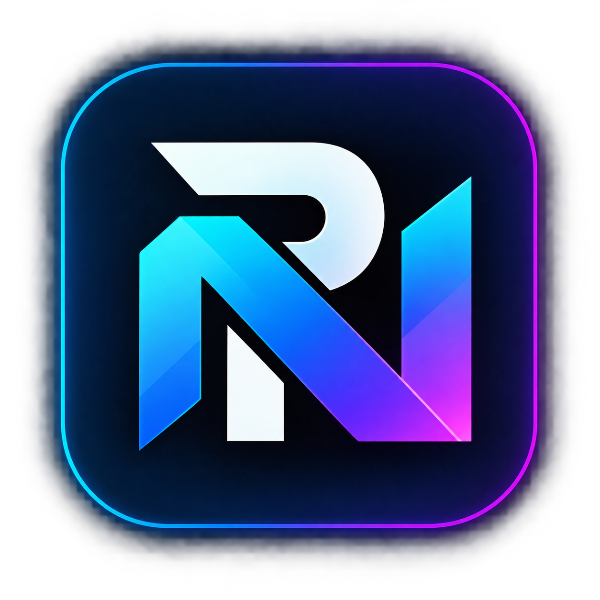
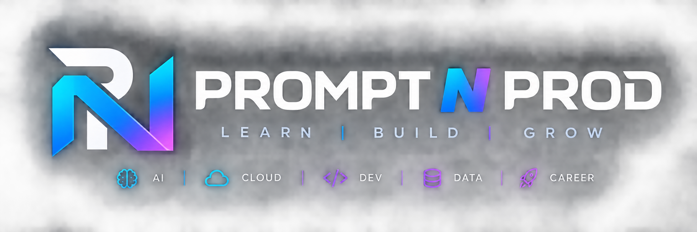
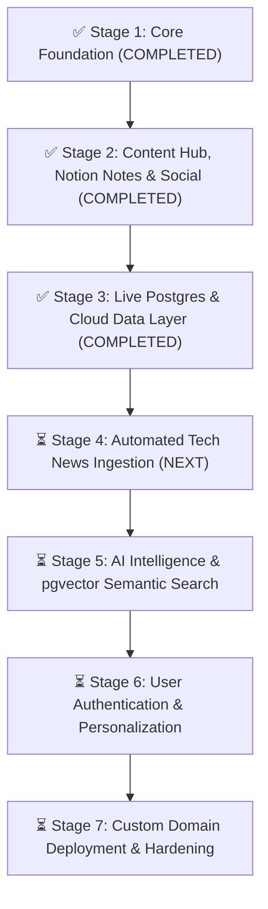

<div align="center">

  

  # Prompt N Prod (v2.0)
  ### From Prompt to Production.
  
  **The high-velocity developer discovery platform: Visual Study Notes, Curated Tech News & Interactive Roadmaps.**
  
  [](https://nextjs.org/)
  [](https://react.dev/)
  [](https://tailwindcss.com/)
  [](https://www.typescriptlang.org/)
  [](https://www.instagram.com/promptnprod)

</div>

---

<p align="center">
  
</p>

## 💡 What is Prompt N Prod?

The developer ecosystem is filled with AI hype and endless text threads that leave you confused. **Prompt N Prod** cuts through the noise with **visual clarity, mental models, interactive roadmaps, and real production code**:

- 🧠 **Visual Study Notes (Notion-Backed)**: Architecture flowcharts, system design breakdowns, and SQL mental models.
- 📰 **Tech News & Radar**: Fast, high-signal breakdowns of major releases (Bun 1.2, DeepSeek, MCP, LLM updates).
- 🗺️ **Interactive Roadmaps & Projects**: Curated learning tracks where every milestone directly embeds a real hands-on project to build.
- 🎬 **Official `@promptnprod` Instagram Hub**: Authentic reels, video teardowns, and interactive on-site embeds.
- ☕ **Developer Culture & Memes**: Relatable dev humor with one-click live synchronization with `r/ProgrammerHumor`.

---

## 🚀 The 4 Core Platform Pillars

### 1. 🧠 Notion-Powered Study Notes (`/notes` & `/notes/[slug]`)
- **Visual Architecture Cheatsheets**:
  - **RAG Architecture: It Was Free vs It Was NOT Free**: Vector DB pricing traps, HNSW indexing, and hybrid BM25 search.
  - **How AI Agents Actually Work**: ReAct loop (Thought, Action, Observation), tool schemas, and infinite loop safeguards.
  - **Visual SQL JOINs Guide**: What actually happens to rows during INNER, LEFT, RIGHT, and ANTI-JOINs.
  - **8 AI Concepts Every Developer Needs in 2026**: Cross-encoders, KV cache compaction, MCP, and LLM-as-a-judge evals.
  - **2026 AI Developer Roadmap**: Recommended tech stack from prompt engineering to distributed agent swarms.
- **Notion Reader UI**: Callout boxes, syntax-highlighted code blocks with copy-to-clipboard, key takeaway pills, and direct deep-links to associated Instagram reels.
- **Headless Notion Sync Engine (`/api/notion/sync`)**: Built-in REST API connector ready to pull live notes directly from your Notion workspace using environment variables.

### 2. 🗺️ Interactive Roadmaps with Hands-On Projects (`/roadmaps` & `/roadmaps/[slug]`)
- **4 Opinionated Engineering Curricula**:
  1. **Full-Stack AI Engineer (2026)**: LLM fundamentals, RAG pipelines, pgvector, MCP servers, and production evals.
  2. **Next.js 15/16 Modern Full-Stack**: React Server Components, Server Actions, Drizzle ORM, and edge optimization.
  3. **Agentic Systems & MCP Architect**: Deterministic state machines, multi-agent swarms, and tool calling.
  4. **Cloud-Native DevOps & Hardening**: Docker multi-stage builds, GitHub Actions CI/CD, and Sentry observability.
- **Embedded Hands-On Project Blueprints**:
  - Each milestone features an expandable **"View Blueprint"** drawer.
  - Includes: Project objective, tech stack badges, architecture flow diagram, key deliverables, and starter code snippets.
- **Interactive Checklist**: Clickable progress toggles with `localStorage` persistence and celebratory confetti upon completion.

### 3. 📰 High-Signal Tech News (`/feed` & `/feed/[slug]`)
- Category filters: *AI & Agents*, *Full-Stack*, *Cloud & Infra*, *Dev Tools*, and *Database*.
- In-depth editorial breakdowns with Executive TL;DRs, *Why It Matters*, *Who Should Care*, and code snippets.
- **Visual Article Studio (`/admin/editor`)**: Interactive authoring tool to write, format, and preview Markdown articles.

### 4. ☕ Developer Culture & Memes (`/memes`)
- Curated dev humor across *Production Outages*, *AI Hype vs Reality*, *CSS Quirks*, and *Junior vs Senior*.
- **Live Reddit Sync**: Automatically fetches trending developer memes directly from `r/ProgrammerHumor` with infinite pagination.
- **Community Submission Modal**: Visitors can submit custom memes with instant image previews.
- Full-screen lightbox preview and persistent upvoting.

---

## 📊 Project Progress: What's Done vs What's Left



### ✅ What is Done (Stages 1, 2 & 3 Completed)

| Feature Area | Status | Key Deliverables |
|---|:---:|---|
| **Core Platform v1** | ✅ **Done** | Next.js 16 (App Router), Turbopack, Tailwind CSS v4, Dark/Light Theme with zero flash, 60fps GPU-composited animations. |
| **Global ⌘K Search** | ✅ **Done** | Client-side Fuse.js fuzzy search indexing all Notes, Roadmaps, Articles, and Memes. |
| **Notion Study Notes** | ✅ **Done** | Dedicated `/notes` directory with 5 preloaded visual cheatsheets, Notion callouts, code blocks, and `/api/notion/sync` API route. |
| **Interactive Roadmaps** | ✅ **Done** | `/roadmaps` with 4 tracks, milestone checkboxes with confetti, and expandable **"Hands-On Project Blueprints"**. |
| **Real Instagram Showcase** | ✅ **Done** | Authentic cover thumbnails for `@promptnprod` reels and posts, interactive on-site lightbox embed player. |
| **Neon Serverless Postgres** | ✅ **Done** | High-performance pooled PostgreSQL on Neon (`promptnprod` database) with zero idle-pause penalty. |
| **Drizzle ORM Data Layer** | ✅ **Done** | Type-safe schema for `memes`, `reactions`, and `comments` with automatic schema pushes (`drizzle-kit push`). |
| **Cloud Meme Persistence** | ✅ **Done** | `/api/memes` route handler: user-submitted community memes persist permanently to Neon alongside live Reddit sync. |
| **Atomic Reactions & Upvotes**| ✅ **Done** | `/api/reactions` route handler: persistent upvotes and helpful reactions across all study notes and memes. |
| **Live Community Discussions**| ✅ **Done** | `/api/comments` route handler & `CommentsSection`: real-time discussion threads on study notes with zero login required. |
| **Mobile Responsiveness** | ✅ **Done** | Tested and verified at 390px mobile viewports (iOS Safari / Android Chrome friendly). |

---

### ⏳ What is Left (Upcoming Roadmap)

#### 🔄 Stage 4: Automated Tech News Ingestion *(Next Immediate Step)*
* [ ] Scheduled serverless cron workers (Vercel Cron / GitHub Actions).
* [ ] Connectors for **GitHub Releases API**, **Hacker News**, and engineering RSS feeds.
* [ ] Deduplication engine that groups related stories into a draft editorial queue.

#### 🔄 Stage 5: AI Intelligence & pgvector Semantic Search
* [ ] Anthropic Claude & DeepSeek API integrations for automated TL;DR summaries.
* [ ] Vector embeddings using `pgvector` (HNSW index) for semantic Q&A across all study notes and roadmaps.

#### 🔄 Stage 6: User Authentication & Personalization
* [ ] User login via **Clerk** or **Supabase Auth**.
* [ ] Cross-device milestone progress synchronization.
* [ ] Personalized engineering radar tailored to each user's chosen tech stack.

#### 🚀 Stage 7: Production Deployment & Domain
* [ ] Connect repository to **Vercel** with automated CI/CD on every `git push`.
* [ ] Map custom domain (e.g. `promptnprod.com` or chosen domain) with automatic SSL.
* [ ] Add Sentry crash telemetry and web analytics.

---

## 💻 Tech Stack

| Layer | Technology | Purpose |
|---|---|---|
| **Framework** | Next.js 16.3.4 (Turbopack) | React Server Components, SSG, Route Handlers, Image Optimization |
| **Language** | TypeScript 5 | Strict end-to-end type safety |
| **Styling** | Tailwind CSS v4 (Oxide) | Modern CSS tokens, responsive glassmorphism |
| **Search** | Fuse.js | High-speed client-side fuzzy search |
| **Notion Engine** | Native REST API | Headless Notion workspace synchronization |
| **Icons** | Lucide React + Custom SVGs | Modern iconography |
| **Theming** | `next-themes` | Dark / Light theme switching |

---

## 🛠️ Getting Started Locally

### Prerequisites
- Node.js `v20.0.0` or higher
- npm `v10` or higher

### Installation & Run

```bash
# 1. Clone the repository
git clone https://github.com/Ashish73653/promptNprod.git
cd promptNprod

# 2. Install dependencies
npm install

# 3. Start local development server
npm run dev
```

Open [http://localhost:3000](http://localhost:3000) in your browser.

To verify the production build:
```bash
npm run build
npm run start
```

---

## 📄 License
MIT License. Built with precision for developers by **Prompt N Prod**.
