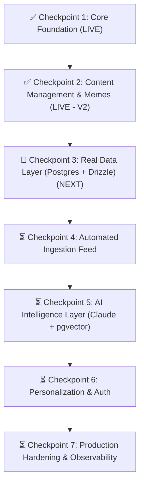

# Prompt N Prod: Platform State & Next Horizon Roadmap

> **Status as of March 2026**: Core Platform Architecture Live  
> **Repository**: [https://github.com/Ashish73653/promptNprod](https://github.com/Ashish73653/promptNprod)  
> **Master Tech Stack**: Next.js 16 (App Router), React 19, TypeScript 5, Tailwind CSS v4, Framer Motion, Fuse.js, next-themes

---

## 1. Executive Summary & Vision

**Prompt N Prod** is an engineering discovery and intelligence platform designed to bridge the gap between prompt experimentation and shipping resilient production software. 

Instead of ad-hoc tutorials and hype-driven influencer threads, the platform provides developers with:
1. **Curated Tech Radar**: High-signal editorial breakdowns of breakthrough models, protocols, and frameworks.
2. **Structured Engineering Roadmaps**: Chronological learning tracks with verifiable milestone checkpoints and local progress memory.
3. **Production Blueprints**: Step-by-step architectural guides and copyable code for complex AI systems.
4. **"Should I Learn This?" Decision Engine**: An objective evaluation framework scoring relevance, impact, difficulty, and hype.
5. **Developer Culture Vault**: Relatable developer memes on production outages, Friday deploys, and agent swarms.

---

## 2. Complete Inventory: What We Have Built (Till Now)

```
Prompt N Prod (Core Platform)
├── Global Navigation & Shell
│   ├── Sticky Glassmorphic Navbar (Brand Logo, V1 Indicator, Active Links, Theme Toggle)
│   ├── Fuse.js Command Palette Modal (⌘K / Ctrl+K fuzzy search across all collections)
│   └── Modern Footer (Newsletter subscription with live feedback, navigation pillars, copyright)
├── Page Catalog & Endpoints
│   ├── / (Homepage with Hero, Trending Radar, Interactive Scorecard, Roadmaps & Blueprints)
│   ├── /feed (Tech Radar Catalog with category filters & search)
│   ├── /feed/[slug] (6 In-depth technical reports with TL;DR, Scorecards, & Code Snippets)
│   ├── /learn (Roadmaps Catalog filterable by experience level)
│   ├── /learn/[slug] (Interactive milestone checklist with localStorage & confetti)
│   ├── /build (Project Blueprints Catalog filterable by difficulty)
│   ├── /build/[slug] (Detailed guided blueprints with architecture diagrams & code)
│   ├── /scorecard (Standalone interactive "Should I Learn This?" calculator)
│   ├── /memes (Developer culture gallery with category tabs, upvotes, & lightbox)
│   └── /about (Mission statement & visual 7-Phase Architecture Roadmap)
├── Design & Brand System
│   ├── Official Assets: Logo.png, Banner1.png, multi-size Favicons, and site.webmanifest
│   ├── Hardware-Accelerated Compositor (strict transform & opacity animations for 60fps)
│   ├── Dual Theme: Dark slate (#07090e) & Crisp porcelain (#f8fafc) via next-themes
│   └── Developer UI: Glassmorphic borders, dev grid pattern, and spotlight hover states
└── SEO & Build Infrastructure
    ├── Automated sitemap.xml indexing 21 canonical routes with priorities
    ├── Standard robots.txt pointing to sitemap
    └── 100% Static Site Generation (SSG) with sub-50ms Global Edge TTFB
```

### 2.1 The Tech Radar Feed (`/feed` & `/feed/[slug]`)
Six publication-grade, technical deep dives covering modern software shifts:
1. **Model Context Protocol (MCP)**: The JSON-RPC 2.0 open standard connecting LLMs with tools and databases.
2. **DeepSeek-V3 & R1**: Large-Scale pure RL, spontaneous reasoning emergence, and local distilled inference.
3. **Next.js Partial Prerendering & Server Actions**: Edge-cached static shells with streaming dynamic slots.
4. **Postgres + pgvector**: HNSW indexes, halfvec quantization, and operational consolidation over dedicated vector DBs.
5. **Tailwind CSS v4 Oxide Engine**: Rust compiler rewrite, zero JS configuration, and pure CSS cascade tokens.
6. **FastAPI vs Go for AI Microservices**: Concurrency benchmarks for streaming SSE connections under heavy load.

*Each article includes: Executive TL;DR, "Why It Matters", "Who Should Care", interactive Scorecard Widget, syntax-highlighted code blocks, and actionable takeaways.*

### 2.2 Structured Roadmaps (`/learn` & `/learn/[slug]`)
Four opinionated engineering tracks:
- **Full-Stack AI Engineer (2026)** (12 weeks, 5 Milestones): Prompt patterns, RAG & pgvector, MCP servers, local models, and evals.
- **Next.js 15/16 & Modern Full-Stack** (8 weeks, 4 Milestones): App Router RSC, Server Actions, Drizzle ORM, and Core Web Vitals.
- **Agentic Systems & MCP Architect** (10 weeks, 4 Milestones): Deterministic state machines, multi-agent swarms, tool protocols, and SWE-bench evals.
- **Cloud-Native DevOps & Hardening** (8 weeks, 4 Milestones): Docker multi-stage builds, GitHub Actions CI/CD, and Sentry telemetry.

*Interactive Feature: Milestone progress is stored in the browser's `localStorage` and triggers celebratory confetti when milestones or tracks are completed.*

### 2.3 Production Project Blueprints (`/build` & `/build/[slug]`)
Four end-to-end architectures:
1. **Autonomous Research Agent with MCP**: TypeScript ReAct loop querying arXiv and storing structured insights in SQLite via MCP tools.
2. **High-Performance RAG Document Intelligence API**: Next.js route handlers, Supabase pgvector HNSW index, and semantic chunking.
3. **Realtime Multi-tenant SaaS Analytics Dashboard**: Server-Sent Events, streaming telemetry, and responsive KPI widgets.
4. **AI-Powered Code Reviewer GitHub Bot**: Webhook HMAC signature verification, git diff chunk parser, and automated PR review critique.

### 2.4 "Should I Learn This?" Interactive Decision Engine (`/scorecard`)
A multi-dimensional scoring rubric calculating an objective index:
$$\text{Score} = 0.45 \times \text{Relevance} + 0.45 \times \text{Impact} - \text{Difficulty Penalty} - \text{Hype Penalty}$$

- **Must Learn (90+)**: Essential industry standard; early adoption unlocks massive career/product leverage.
- **High Priority (75-89)**: Battle-tested architectural investment; adopt on your next sprint.
- **Watch & Evaluate (50-74)**: Promising technology; monitor until ecosystem tooling stabilizes.
- **Niche / Wait (<50)**: Experimental prototype or high hype-to-substance ratio.

### 2.5 Developer Culture & Memes (`/memes`)
- Curated dev humor across *Production*, *AI Hype*, *Frontend/CSS*, and *Junior vs Senior*.
- Persistent upvotes saved in `localStorage`, full-screen lightbox preview, and one-click share links.

### 2.6 Command Palette (`⌘K` / `Ctrl+K`)
- Powered by **Fuse.js** client-side fuzzy indexing over all articles, roadmaps, blueprints, and memes.
- Instant keyboard navigation with arrow keys and Enter.

### 2.7 Official Branding & Asset Integration
- Integrated `Logo.png`, `Banner1.png`, and `favicon.ico` from the project's brand asset vault.
- Version `V2` is cleanly positioned directly beside the navbar logo (`PromptNProd [V2]`).
- Professional, high-signal engineering terminology throughout all pages.

---

## 3. What We Will Be Doing Next: The 7-Phase Build Plan



---

### Checkpoint 2: Headless Content Management & Community Hub (✅ Completed - V2)
**Delivered Features**:
- **Git-based Markdown Pipeline (`src/lib/content.ts`)**:
  - Implemented dynamic Markdown parsing with `gray-matter`.
  - Dropping any `.md` file into `content/articles/` automatically compiles it into a full SSG page (`/feed/[slug]`) and indexes it in `sitemap.xml`.
- **Visual Article & Markdown Studio (`/admin/editor`)**:
  - Low-code authoring studio with real-time "Should I Learn This?" scoring rubric sliders.
  - Split-screen live preview replicating production typography and layout.
  - One-click copy or `.md` file download.
- **Automated Reddit Meme Synchronization (`/memes`)**:
  - Background auto-pull from `r/ProgrammerHumor` on page load with zero manual clicks required.
  - Infinite "Load More Memes" pagination button.
  - "Submit a Meme" community modal with live image preview and persistent client storage.
  - Completely removed hardcoded/mock memes from the entire site.

---

### Checkpoint 3: Real Data Layer (Postgres & API Layer) (Upcoming - NEXT)
**Target Timeline: 2-3 weeks**  
**Goal**: Transition from client-side `localStorage` to managed cloud persistence.

- **Database Infrastructure**:
  - Provision managed Postgres database on **Supabase** or **Neon**.
  - Type-safe schema definition using **Drizzle ORM**.
- **Data Models**:
  - `articles`: Content, metadata, editorial scorecards, view counts.
  - `roadmaps` & `milestones`: Structured curricula and prerequisites.
  - `user_progress`: Synced milestone completion and personal notes.
  - `reactions`: Global upvote and like counters synchronized in real time.
- **API Surface**:
  - Next.js 16 Route Handlers (`/api/feed`, `/api/roadmaps`, `/api/reactions`, `/api/scorecard`).
  - Strict input schema validation with **Zod**.

---

### Checkpoint 4: Automated Tech News Ingestion Pipeline
**Target Timeline: 2-3 weeks**  
**Goal**: The platform discovers new tech news automatically without manual entry.

- **Scheduled Ingestion Jobs**:
  - Serverless cron workers (Vercel Cron or GitHub Actions cron jobs).
- **Source Ingestion Connectors**:
  - **GitHub Releases API**: Monitors top 200 open-source repositories for major version bumps and breaking changes.
  - **RSS Feeds**: Pulls from Hacker News, ArXiv Computer Science / AI papers, and major engineering blogs.
  - **YouTube API**: Monitors top developer conference keynotes and changelog streams.
- **Deduplication Engine**:
  - Normalizes URLs, detects duplicate story angles, and stores items in a `pending_review` database table.

---

### Checkpoint 5: AI Intelligence Layer (Claude & pgvector)
**Target Timeline: 3-4 weeks**  
**Goal**: Every ingested tech development receives automated AI contextualization.

- **Anthropic Claude & DeepSeek API Integration**:
  - Automatically synthesizes:
    - Executive TL;DR in 3 bullet points.
    - "Why It Matters" from a senior engineer's perspective.
    - "Who Should Care" target persona breakdown.
    - Automated first-pass draft of the "Should I Learn This?" scorecard.
- **Vector Search & RAG**:
  - Embed all platform articles, roadmaps, and code blueprints into **pgvector** using `text-embedding-3-small` or `nomic-embed`.
  - HNSW indexing for sub-10ms semantic similarity queries.
  - "Related Reading" and "Recommended Blueprints" powered by vector distance.

---

### Checkpoint 6: Personalization & Developer Auth
**Target Timeline: 3-5 weeks**  
**Goal**: Turn Prompt N Prod into a personalized daily intelligence dashboard.

- **Authentication**:
  - Integrate **Supabase Auth** or **Clerk** (GitHub OAuth + Magic Link login).
- **User Profiles & Bookmarking**:
  - Save articles, star project blueprints, and sync roadmap milestone progress across devices.
- **Tailored Tech Radar**:
  - Users select their current stack (e.g. *Next.js, Python, AWS, Postgres*).
  - Custom feed prioritizing updates directly relevant to their stack and career goals.
- **Weekly Digest**:
  - Opt-in email digest delivering the top 3 highest-scoring technologies of the week.

---

### Checkpoint 7: Production Hardening & Observability
**Target Timeline: Ongoing**  
**Goal**: 99.99% availability, zero regression deploys, and automated performance enforcement.

- **Continuous Integration / Continuous Deployment (CI/CD)**:
  - GitHub Actions running linting, TypeScript compilation, and Lighthouse performance checks on every pull request.
  - Automated preview deployments on Vercel for every branch.
- **Observability**:
  - **Sentry**: Real-time error tracking and crash alerts on Discord/Slack.
  - **Better Stack**: Uptime monitoring with 30-second ping intervals.
  - Core Web Vitals telemetry tracking LCP, INP, and CLS across real user sessions.

---

## 4. Immediate Next Action Items (Checkpoint 2 Sprint)

To begin Checkpoint 2, the recommended next tasks are:

| Priority | Task | Description |
|:---:|---|---|
| **P0** | **MDX Content Pipeline** | Set up Markdown + MDX rendering for articles and roadmaps with embedded React components. |
| **P1** | **On-Demand ISR Route** | Create `/api/revalidate` route to enable instant webhook-driven cache clearing. |
| **P2** | **CMS Adapter** | Connect either Notion or Sanity as the visual drafting backend. |
| **P3** | **Interactive Code Runner Component** | Add an interactive code runner widget to project blueprints for live client-side TypeScript execution. |

---

*This document serves as the single source of truth for Prompt N Prod's architectural state and future development roadmap.*
